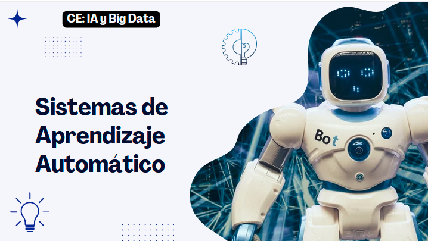

# Sistemas de Aprendizaje Automático

Correo Profe: mpreciadoa02@iesalbarregas.es

## Tema 1: Inteligencia Artificial Fuerte y Debil

1. Definición: La IA es la simulación de procesos de inteligencia humana por parte de sistemas informáticos.

La inteligencia artificial es la inteligencia llevada a cabo por máquinas.

- Dichos procesos son:
  - El aprendizaje a través de la adquisición de información y sus reglas de uso.
  - El razonamiento usando las reglas para llegar a conclusiones aproximadas o definitivas.
  - La autocorrección.

Los primeros trabajos de inteligencia artificial fueron llevados a cabo por McCulloch y Pitts en 1940 quienes desarrollaron un modelo automático de la neurona.

2. Diferencias entre la Inteligencia Artificial Fuerte y Débil:

    2.1. Inteligencia Artificial Fuerte: 
   - Definición: Consiste en hacer que las máquinas no solo simulen la forma de actuar y de comportarse del ser humano, sino que realmente piensen. Es aquella Inteligencia que iguala o excede la Inteligencia humana.
   - Características:
     - 

# Tema 2: Maching Learning