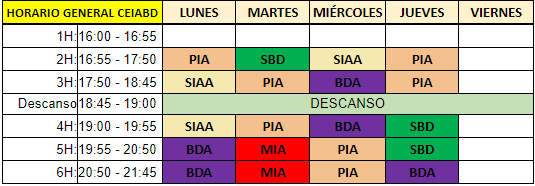

# Curso de Especialización en Inteligencia Artificial en Big Data

Aula: **ATECA** (<u>antigua aula de **DAM2**</u>), situada en la primera planta justo al lado del aula **CISCO**

# Asignaturas:

- PIA: **Programación de Inteligencia Artificial**

- SIAA: **Sistemas de Aprendizaje Automático**

- MIA: **Modelos de Inteligencia Artificial**

- BDA: **Big Data Aplicado**

- SBD: **Sistemas de Big Data**
