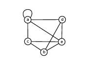
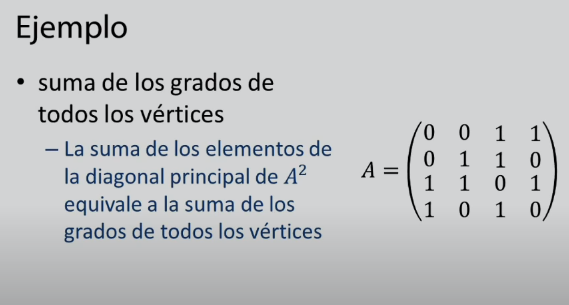

# AMPLIACIÓN DE MATEMÁTICAS

Profesor: Mario Martínez Pizarro

Departamento de Matemáticas. Despacho 25

Url Campus: [AMA](https://campusvirtual.unex.es/zonauex/avuex/course/view.php?id=8467)

Correo: mariomp@unex.es

Grupo: A(Lab I): 12-13

Pareja: Fredy

*Poner en asunto de los correos al profe: AMA I

- SAGE

:point_right:  [Url Sage](https://sage-cum.unex.es:8015/)

- Credenciales Sage:

  - Username: GIT21jelanang
  - !Password: Y7369285
  - User Teacher: mariomp2223

Tutoria:

# APUNTES

## Tema 1:  Teoría en Grafos

Publicado el 13/09/2022

¿Qué es un grafo? Es un conjunto de objetos llamados vértices o nodos unidos por enlaces llamados aristas o arcos, que permiten representar relaciones binarias entre elementos de un conjunto.

Año de creación: 1735

Creador: Leonard Euler

- El problema de los puentes de Konigsberg:
  También llamado el problema de los 7 puentes de Königsberg, es un problema matemático que consistía en encontrar un recorrido para cruzar a pie toda la ciudad pasando solo una vez por cada uno de los puentes y regresando al mismo punto de inicio. Dicho problema se resuelve a través de los grafos eulerianos.

¿Qué permiten los grafos? Permiten modelizar situaciones para saber si los objetos están relacionados.

- Aplicaciones de un grafo:
  - Redes
  - Diagramas de flujo
  - Bases de Datos
  - etc...

Ejemplo de un grafo: una red de computadoras(donde los vertices son los terminales y las aristas las conexiones inalámbricas o cables).

- Un grafo (V,E) está formado por

  - un conjunto de vértices V
  - un conjunto de aristas E
- Aristas: son enlaces que unen o conectan dos vértices.
- Vértices: son los nodos.

  - Vértices adyacentes: son aquellos que están conectados mediante la misma arista.

- Tipos de Grafos:

  - Pseudografo: Son vértices conectados con ellos mismos, es decir, que tienen un lazo, una arista que se conecta al mismo vértice.

  

  - Multigrafo: Es cuando hay más de una conexión, arista o extremo entre dos vértices, dichas aristas se llaman paralelas.

  

  - Multipseudografo: Es un multigrafo donde aparecen lazos.
  - Digrafo o grafo dirigido: Son aristas representadas con una flecha, es decir, son pares de vértices ordenados.

  

  - Isomorfos: si tengo dos grafos, renombro los vértices y aristas del primero obtenemos el segundo. También tienen que tener los mismos ciclos y las imágenes tienen que ser las mismas.

  

  

  

  

  

  

  - Subgrafo de un grafo: es un grafo obtenido tomando un subconjunto de vértices y un subconjunto de aristas y todos los extremos de estas.

    
  - Subgrafo Completo: es un grafo obtenido tomando un subconjunto de vértices y todas las aristas cuyos extremos sean esos vértices.

    
  - Listas:

    

    - Lista de incidencia: Se enumeran las aristas.

      
    - Lista de adyacencia: Se enumeran los vértices adyacentes.

      
  - Matriz: los grafos se pueden representar mediante una matriz.

    - Propiedades:

      - Una matriz nos permite saber el total de caminos diferentes en un grafo, multigrafo o digrafo G, de longitud r, desde el vértice vi al vj, es igual al elemento aij ∈ Ar
      - La suma de los elementos de la diagonal principal de A2 equivale a la suma de los grados de todos los vértices de G.

      

      

      
  - Matriz de incidencia: Se representan las aristas. -1 del vértice que sale y 1 al vértice que llega.

    - Grafo:

      

      
    - Digrafo:

      

      

DUDA: En una matriz de incidencia se supone que las columnas son las aristas y las filas los vértices, entonces no entiendo, por qué en el ejemplo del tema 1 aparece al revés.

DUDA RESUELTA: En una matriz de incidencia las columnas pueden representar las aristas o vértices, depende de lo que queramos hacer con la matriz.

- Matriz de adyacencia: En la posición (i, j) hay un 1 si las aristas i, j son adyacentes.
  - Nos permite saber

NOTA:Si el grafo no es dirigido la matriz va a ser simétrica.

- Grado de un vértice: Es el número de aristas que lo tienen como extremo.

  - Ejemplo:

  

  En el grado de la figura: gr(a) = 3, gr(b) = 3, gr(c) = 3, gr(d) = 4

  - Secuencia de grados de un grafo: es la lista (decreciente) de los grados del grafo.
    (4,3,3,3,3)
    - Si dos grafos son isomorfos, entonces tienen la misma secuencia de grados, pero dos grafos pueden tener la misma secuencia de grados y no ser isomorfos.

      
    - Propiedades:

      - La suma de los grados es igual al doble del número de aristas.
      - En particular, la suma de los grados es un número par.
      - Algoritmo de Havel-Hakimi: Para determinar si una secuencia de números naturales n1 >= n2 ... >= nk >= 0 es la secuencia de grados de un grafo, debemos usar el siguiente algoritmo:
        - Si todos los elementos son cero, terminamos con respuesta afirmativa. En caso contrario:
          - Eliminamos n1 de la secuencia y restamos 1 a (los primeros) n1 elementos.
          - Si algún entero toma valor negativo, terminamos con respuesta negativa.
          - Reordenamos la secuencia de mayor a menor.
          - Volvemos al primer paso.

            
- Grafo Completo: es un grafo tal que todos los pares de vértices están conectados.

  Denotamos Kn al grafo completo de n vértices.

  
- Grafo k-regular: Es todo grafo tal que todos sus vértices tienen grado k.

  Todo grafo completo Kn es n-1 regular, es decir, todo grafo completo es regular pero no todo grafo regular es completo.

- Caminos en un grafo:

  - Camino: Sucesión finita de vertices de modo que cada dos consecutivos son adyacentes.
  - Longitud: Es el número de aristas dentro de un camino.
  -
  -
- Grafo euleriano: Es aquel en el que existe un circuito que recorre todas las aristas.
- Toda secuencia de grados de un grafo que tiene grados pares es euleriano.
- Todo grafo euleriano tiene secuencia de grados pares
- Grafo Hamiltoniano: existe un ciclo.

  - Ciclo: Camino cerrado que recorra todos los vértices sin que se repita ningún vértice salvo el extremo.
- Ejemplos:

