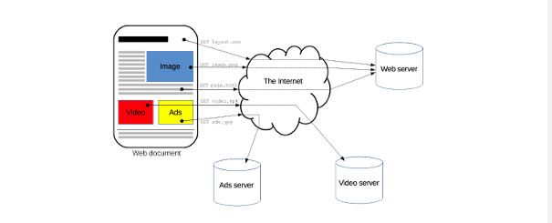
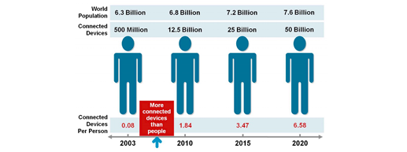

# Diseño y Programación Web

Profesor: Enrique Moguel

Despacho: ?

Correo: enrique@unex.es

Url Campus: [DPW](https://campusvirtual.unex.es/zonauex/avuex/course/view.php?id=19173)

# APUNTES
## Tema 1: Introducción a la web

Publicado el /09/2022

- Protocolo HTTP("Hipertext Transfer Protocol"). Es el protocolo de comunicación que permite las transferencias de información a través de archivos (XML, HTML...) en la World Wide Web.

<pre>
Palabras clave:
    - Protocolo: Es un sistema de reglas que permiten la comunicación entre dos o más entidades.
</pre>

- Estándares W3C("Wordl Wide Web Consortium")

- Web se utiliza como abreviatura de world wide web (www).
  - Es un mecanismo de internet que nos permite la búsqueda de documentos conectados mediante enlaces de hypertexto.
  - Internet es un sistema global de redes de ordenadores interconectadas que ysa la pila de protocolos TCP/IP para conectar miles de millones de dispositivos.

- Tim Berners-Lee: Desarrolló en 1980 ENRIQUE(proyecto del CERN)

