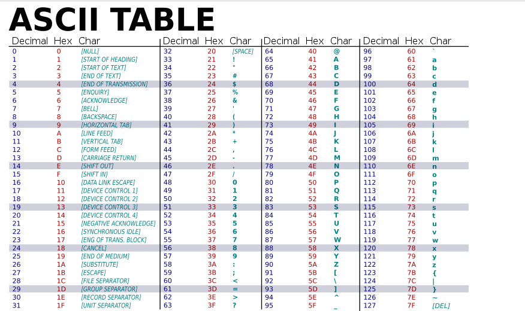

# ESTRUCTURA DE COMPUTADORES

Profesor Teoría: Javier Plaza Miguel

Despacho: 17

Correo: jplaza@unex.es

Profesora Prácticas: Violeta Hidalgo Izquierdo

Despacho: 15

Correo: vhidalgo@unex.es

[[Note success | Hola ]]

Grupo: A(Jueves) 12-14h

Url Campus: [EC](https://campusvirtual.unex.es/zonauex/avuex/course/view.php?id=12187)

Entraga de los ejercicios:

- [entrega 1](https://campusvirtual.unex.es/zonauex/avuex/mod/assign/view.php?id=1535967)
- [entrega 2](https://campusvirtual.unex.es/zonauex/avuex/mod/assign/view.php?id=1538368)
- [entrega 3](https://campusvirtual.unex.es/zonauex/avuex/mod/assign/view.php?id=1540332)
- [entrega 4](https://campusvirtual.unex.es/zonauex/avuex/mod/assign/view.php?id=1542746)
- [entrega 5](https://campusvirtual.unex.es/zonauex/avuex/mod/assign/view.php?id=1546607)

# APUNTES

## Tema 1: Estructura de Computadores en el Plan de estudios del Grado en IITI

Publicado el 13/09/2022

            <pre>
                DUDAS:
                        Diferencia entre monociclo y multiciclo.
                        Formato de instruccciones
                        Diferencia entre arquitectura y estructura
            </pre>
            <pre>
                KEYWORDS:
                <ul>
                    <li>Estructura</li>
                    <li>arquitectura</li>
                    <li>ISA</li>
                    <li>direccionamiento</li>
                    <li>interrupciones</li>
                    <li>mecanismos de entrada y salida</li>
                    <li>organizacion</li>
                    <li>Taxonomia de Flynn</li>
                </ul>
            </pre>
            <pre>
                RESUMEN:
                         - La arquitectura es el conjunto de atributos que el hardware ofrece o que son visibles para el programador y que el usuario usa a bajo nivel.
                         - El decidir el como es cuestion arquitectonica y lo que tiene que hacer es estructural.
                         - Siempre que hablamos de ISA nos referimos a la arquitectura.
                         - La mayor parte de las maquinas estan construidas con la misma ISA pero tienen distinta organiacion o estructura
                         - La aportacion de Von Neumman fue los programas almacenados yaque anteriormente se insertaba una tarjeta la cual contenia un programa que se interpretaba en la maquina tras su insercion
                         - Una unica instruccion sobre un unico dato, Arquitectura de Von Neumman
            </pre>
            <pre>
                QUESTIONS:
                <ul>
                    <li>Se dice que la arquitectura de Von Neumman utiliza una unica memoria para datos e instrucciones, en cambio la de Harvard</li>
                </ul>
            </pre>

    <table><th>Diferencias entre procesadores CISC y RISC.</th>
    <tr><td>Siglas: Complex Instruction Set Computer</td><td>es un sistema de instrucciones desarrollado por Intel que requieren de mucho tiempo para ser ejecutadas completamente.</td><td>CISC</td><td>Tiene una sencilla decodificación de las instrucciones</td><td>reduce la cantidad de instrucciones de un software y se ignora el número de ciclos por instrucción. Se especializa en crear instrucciones complejas en el hardware, ya que el hardware siempre será mucho más rápido que el software.</td><td>Los usos de la canalización son simples</td></tr>
</table>

<ul>
    <li>El entorno exterior cambia a un ritmo mayor que el interior, es decir, El aumento en cuanto a la demanda de las aplicaciones es mayor que la mejora de los microprocesadores.</li>
    <li>Cuanto más complejo es el lenguaje de programación mayor es el número de instrucciones.</li>
    <li>La programación en ensamblador es más eficiente</li>
    <li>La tecnología ha hecho que los microprocesadores se compliquen</li>
    <li>La aparición de los multiprocesadores se debe a la necesidad de aumentar el número de transistores, la eficiencia y la capacidad de la memoria.</li>
</ul>

# Tema 2: Arquitectura del repertorio de instrucciones

- Dudas:

  - ciclo TIC y TOC
  - Arquitectura tipo pila y acumulador
- Modo de direccionamiento: Las diferentes formas que tiene la arquitectura en la forma de operar las instrucciones.
- El registro a registro es más rápido porque accedes directamente a las operaciones.
- En cualquier arquitectura la operación más rápida es de memoria
- Ejercicio:

  - problema 11: A = ((B + C) * D)/(E - F * G - H * I)
- Pila:

| Instrucciones PILA |
| ------------------ |
| PUSH B             |
| PUSH D             |
| ADD                |
| PUSH D             |
| MUL                |
| POP E              |
| PUSH F             |
| PUSH G             |
| MUL                |
| SUB                |
| PUSH H             |
| PUSH I             |
| MUL                |
| SUB                |
| DIV                |
| POP A              |

| ACUMULADOR |
| ---------- |
| LOAD B     |
| ADD C      |
| MUL D      |
| STORE AUX1 |
| LOAD F     |
| MUL G      |
| STORE AUX2 |
| LOAD H     |
| MUL I      |
| STORE AUX3 |
| LOAD E     |
| SUB AUX2   |
| SUB AUX3   |
| STORE AUX4 |
| LOAD AUX1  |
| DIV AUX4   |
| STORE A    |

| REGISTRO A REGISTRO |
| ------------------- |
| LOAD R1, B          |
| LOAD                |

Variables ortogonales son aquellos que son independientes entre sí.

Ejercicio 1:

- 32 bits -->Representa el tamaño de palabra
- 16 REG(32 bits) -->4bits
- 256 MPalabras --> 28bits
- **MOVE ORIGEN DESTINO**
- **ADD DESTINO OP1 OP2**
- 7 **MD**
- **ORTOGONALES**

| COP | OP1 | OP2 |
| --- | --- | --- |
| 1   |     |     |

