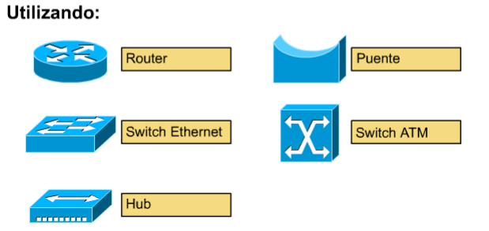
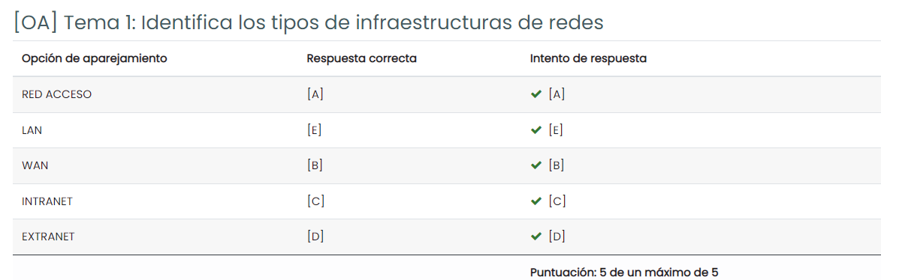

# Fundamentos de Redes

Profesor: Miguel Á. Martín Tardío

Despacho: 41

Url Campus: [FR](https://campusvirtual.unex.es/zonauex/avuex/course/view.php?id=6323)

Correo: matardio@unex.es

Pareja de trabajo: Jesús 

# APUNTES
## Temas: 
<ol>
    <li><a href="#tema1">Introducción a la comunicación en Red</a></li>
    <li><a href="#tema2">Normalización de las Comunicaciones</a></li>
    <li><a href="#tema3">La Capa de Aplicación</a></li>
    <li><a href="#tema4">La Capa de Transporte: TCP y UDP</a></li>
    <li><a href="#tema5">La Capa de Red(I)</a></li>
    <li><a href="#tema6">La Capa de Red(II)</a></li>
    <li><a href="#tema7">La Capa de Enlace de Datos</a></li>
    <li><a href="#tema8">Introducción a las Redes Ethernet</a></li>
    <li><a href="#tema9">La Capa Física(Opcional)</a></li>
</ol>

Tema 1: Introducción a la comunicación en Red

Publicado el 14/09/2022

### Contenidos:

<ol>
    <li><a href="#definicion">¿QUÉ ES LA COMUNICACIÓN? UN MUNDO CONECTADO</a></li>
    <li><a href="#comunicacion">COMUNICACIÓN A TRAVÉS DE REDES</a></li>
    <li><a href="#arquitectura">ARQUITECTURA DE RED</a></li>
    <li><a href="#parametros">PARÁMETROS DE REDES</a></li>
    <li><a href="#plataforma">PLATAFORMA PARA LAS COMUNICACIONES</a></li>
</ol>

1. ¿QUÉ ES LA COMUNICACIÓN?

La comunicación es algo intrínseco al ser humano porque el ser humano siempre ha tenido la necesidad de comunicarse con los demás y con el medio que le rodeaba y para ello usaba varias técnicas, tales como los gestos, el lenguaje hablado, la escritura, símbolos, ...

- Tipos de comunicación:
    - Comunicación directa: Gestos y lenguaje hablado, el primero menos expresivo y más intuitivo que el segundo, el segundo más significativo.
    - Comunicación a distancia: debido a entornos geográficamente distantes.
  
        Fecha: Primera mitad del siglo XIX.
  
        Se inventan técnicas particulares como: 
      - Señales de humo.
      - Destellos con espejos.
      - Posicionamientos con banderas.
      - Señales de luz.
- Términos:
  - Telecomunicación(Tele->Distancia o Lejos. Comunicación a Distancia). Es un sistema de comunicación telegráfica, telefónica o radiotelegráfica.
  
     Fecha de invención: 1830 con la utilización del Telégrafo, creado por Samuel F.B. Morse usando su código.
  - Informática:(Información y Autómata. Tratamiento automático de la información). Es un conjunto de conocimientos científicos y técnicas que hacen posible el tratamiento automático de la información por medio de ordenadores.
  - Telemática. Es la convergencia entre las telecomunicaciones y la informática, es decir, es la ciencia que trata de la conectividad y comunicación a distancia entre procesos.

- Fechas de invenciones:
  - 1876: Alexander Graham Bell inventó el Teléfono dando lugar a la comunicación de la voz a distancia.
  - 1910: Teleimpresor remplazando así la telegrafía manual.
  - 1950: MODEM, comienzan los primeros intentos de transmisión de datos entre ordenadores y fue implantado definitivamente en los años 70.
  - Década de los 60: Satélites de comunicaciones, lenguajes de programación interactivos, Sistemas operativos conversacionales, tecnología de conmutación de paquetes, red telefónica.
  - Década de los 70: Redes especializadas en transmisión de datos o Redes de ordenadores, protocolos y arquitecturas telemáticas, Procesos de normalización y estandarización.
  - 1971: Nace ARPANET, fundada por DARPA por encargo del DOD para tener acceso a información militar desde cualquier punto del país en caso de algún ataque ruso. Lo cual dio origen a la red Internet. En dicha red se desarrolló el conjunto de protocolos TCP\IP.
  - 1972: Nace en España la primera red pública de conmutación de paquetes denominada Red Especial de Transmisión de Datos(RETD).
  - 1976: ISO(Organización de Estándares Internacionales) modela y normaliza la interconexión de ordenadores creando el Modelo Básico de Referencia para la Interconexión de Sistemas Abiertos(OSI).
  - 1978: Aparecen las Redes de Área Local(LAN) que permiten la interconexión entre equipos informáticos en entornos reducidos(Ethernet, Token-Ring y FDDI).
  - Década de los 80: Ordenador Personal (IBM PC), Servicios de Valor añadido (Teletex, Telefax, Vidotex, ...), Redes Digitales (Integración texto, datos, imagen y voz).
  - Década de los 90: Tecnologías multimedia, Redes de Banda Ancha (FRAME RELAY, ATM, ADSL), Servicios de Telefonía Móvil y Servicios IP
  - Siglo XXI: IPv6 e INTERNET 2, Tecnologías inalámbricas, edificios y hogares inteligentes, PAN(Redes de Área Persona) como BIO-redes.

- Sistema Telemático es un conjunto de recursos hardware y software utilizados para satisfacer unas determinadas necesidades de transmisión de datos.

    - Red de Transmisión de Datos: Es un conjunto de elementos físicos y lógicos para la interconexión de equipos y satisfacen todas las necesidades de comunicación de datos entre los mismos.

    - Red a pie: Consistía en que anteriormente en una empresa había empleados que tenían ordenadores conectados a una impresora y otros empleados que solo tenían el ordenador y entonces cuando querían imprimir sus documentos tenían que copiar dichos documentos en disquetes.

    - LAN: se inventó para sustituir la red a pie, lo que permitía que los usuarios que se encontraban dentro de un mismo departamento pudieran transferir rápidamente archivos a través de la red electrónica. 
            Las impresoras autónomas fueron sustituidas por impresoras de red de alta velocidad, compartidas por todo el departamento. Pero en aquel entonces la red a pie era normalmente la única manera posible de compartir archivos con los empleados de otro departamento, o que estuvieran conectados a otra LAN.
- Problemas de la internetworking:
  - Duplicación de equipos y recursos.
  - Incapacidad de comunicarse con cualquier persona, en cualquier momento y lugar.
  - Falta de una administración de LAN.
  
    

- Tipos de redes:
  - LAN(Redes de área local): Creadas para responder las necesidades de tratamiento de la información a pequeñas distancias.
    - Operan dentro de un área geográfica limitada.
    - Permite el multiacceso a medios con alto ancho de banda.
    - Controla la red de forma privada con administración local.
    - Proporciona conectividad continua a los servicios locales.
    - Conecta dispositivos físicamente adyacentes.
    
    
    
    
  
  - WAN(Red de área extensa): Surgen para satisfacer las necesidades de transmisión de datos a distancias mayores de unos pocos kilómetros. La más común son las redes públicas de Telecomunicación existentes en casi todos los países.
    - Operan en áreas geográficas extensas.
    - Permiten el acceso a través de interfaces seriales que operan a velocidades reducidas.
    - Suministran conectividad continua y parcial.
    - Conectan dispositivos separados por grandes distancias e incluso a nivel mundial.
    
    
    
    
     
  - Ancho de Banda:
    
    
    
    
  
  - Variables que afectan al rendimiento: El rendimiento tiene que ser menor o igual al ancho de Banda. 
    - PC(cliente).
    - Servidor.
    - Otros usuarios de su LAN.
    - Enrutamiento dentro de la Nube.
    - El diseño(topología) de todas las redes involucradas.
    - Tipo de datos que se transfieren.
    - Hora.
  
- Cálculo del tiempo de transferencia de archivos:
  - Mejor descarga de archivos: T = S/BW
  - Descarga de archivos típica: T = S/P
  - BW = Máximo ancho de Banda teórico del enlace más lento entre el host origen y destino.
  - P = Rendimiento real en el momento de la transferencia.
  - T = Tiempo que demora la transferencia de archivo.
  - S = Tamaño del archivo en bits.
   
# EJERCICIOS:

Actividad Práctica 1(AP01): Pruebas de conectividad y rastreo de Internet(Parte 1).

Actividad Práctica 2(AP02): Pruebas de conectividad y rastreo de Internet(Parte 2).

[OA] Actividad 1.5: Identifica los tipos de infraestructuras de redes.

[OA] Actividad 1.4: Ejercicios de retardo.

[OA] Actividad 1.3: Ejercicios de ancho de banda digital.

[OA] Actividad 1.2: Características de una arquitectura de red.

[OA] Actividad 1.1: Componentes de Red.
