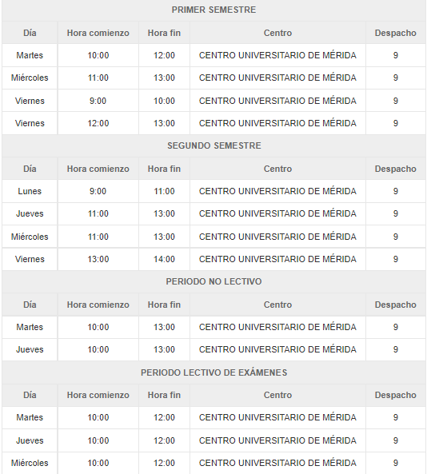

# Metodología y Desarrollo de Programas

Profesor: Luis Arévalo Rosado

Despacho: 9

Correo: ljarevalo@unex.es

Grupo: A(Martes) 12-14h

Url Campus: [MDP](https://campusvirtual.unex.es/zonauex/avuex/course/view.php?id=11403)

- Fecha pruebas:

- [X]  Entrega sesion 3: 4 y 5 octubre
- [X]  Evaluacion tipo TEST(OO, Comp, Herencia, Colecciones): 7 octubre
- [X]  Evaluacion tipo TEST(T1 y T2): 14 octubre
- [ ]  Evaluacion tipo TEST(): 21 octubre

Tutoria:

# APUNTES

## Tema 1: Desarrollo de Software

Publicado el /09/2022

software son instrucciones de ordenador que cuando se ejecutan cumplen una función y tienen
