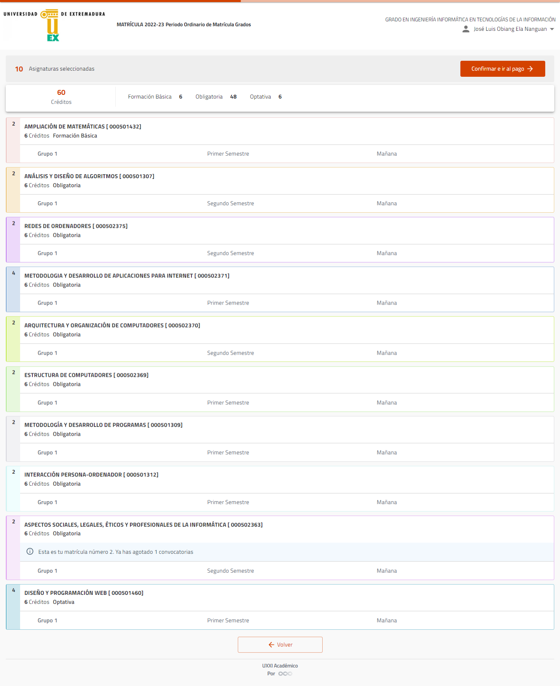
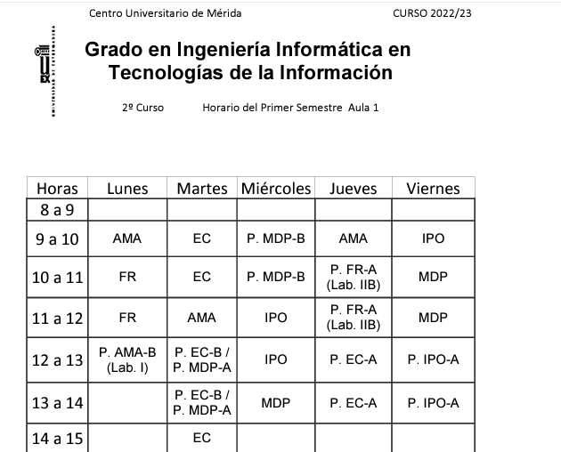
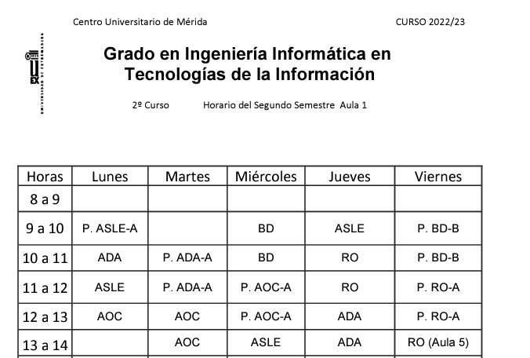
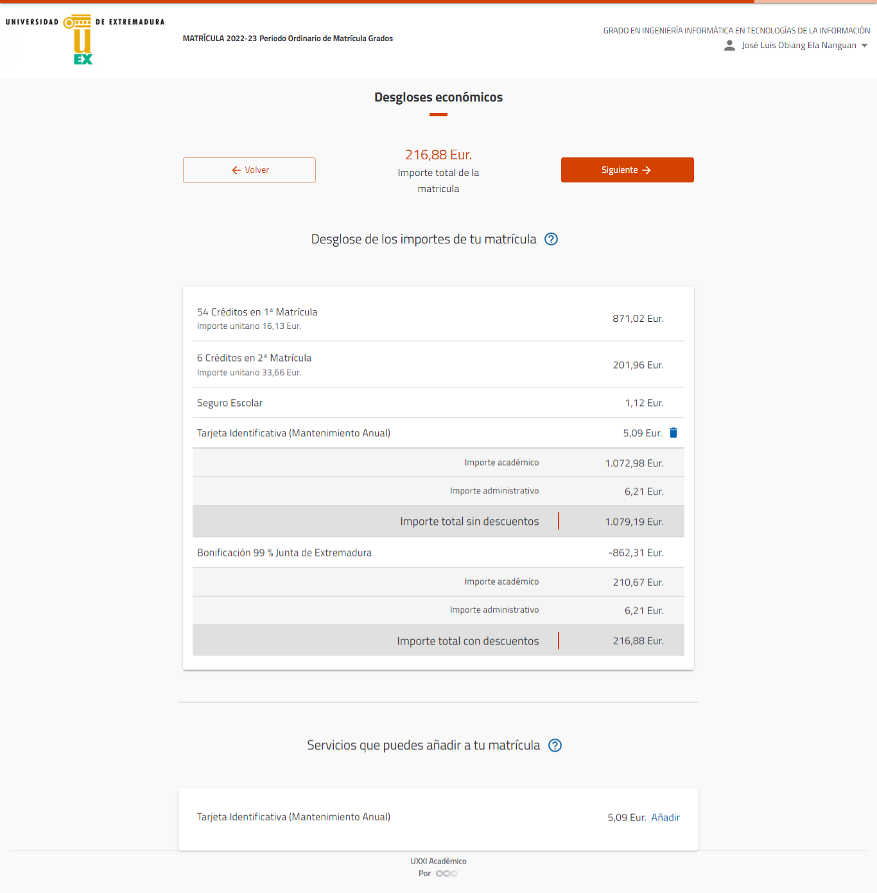

# Todas las asignaturas matriculadas

[Apuntes UNI años pasados](https://unexes-my.sharepoint.com/:f:/g/personal/aelanang_alumnos_unex_es/EkxouImL7VtChjCdSGE1848BwjXmjv9VyUk5IAuBBsAfgQ)




# CALENDARIO ACADÉMICO

## Primer semestre


| ASIGNATURAS                                                  |
|--------------------------------------------------------------|
| Ampliación de Matemáticas(AMA)                               |
| Estructura de Computadores(EC)                               |
| Interacción Persona-Ordenador(IPO)                           |
| Metodología y Desarrollo de Programas(MDP)                   |
| Diseño y Programación Web(OPT-2)                             |
| Metodología y Desarrollo de aplicaciones para Internet(MDAI) |

**ENLACES:**

[IPO](https://www.unex.es/conoce-la-uex/centros/cum/titulaciones/info/asignatura?id=1514&id_asig=501312)
[FR](https://www.unex.es/conoce-la-uex/centros/cum/titulaciones/info/asignatura?id=1514&id_asig=501426)
[AMA](https://www.unex.es/conoce-la-uex/centros/cum/titulaciones/info/asignatura?id=1514&id_asig=501432)
[MDP](https://www.unex.es/conoce-la-uex/centros/cum/titulaciones/info/asignatura?id=1590&id_asig=501309)
[OPT-2](https://www.unex.es/conoce-la-uex/centros/cum/titulaciones/info/asignatura?&id=1514&id_asig=501460)
[MDAI](https://www.ºunex.es/conoce-la-uex/centros/cum/titulaciones/info/asignatura?id=1514&id_asig=502371)


***LUNES:***
- [ ]  Clase Teórica de OPT-2(DPW): 15-16:25
- [ ]  Clase Práctica de AMA-A(Lab I): 12-13

***MARTES***
- [ ]  Clase Práctica de MDP-A(): 12-14
- [ ]  Clase Teórica de MDAI: 17-19

***MIÉRCOLES***
- [ ]  Clase Práctica de OPT-2(DPW): 15-16:25

***JUEVES***
- [ ]  Clase Práctica de FR-A: 10-12
- [ ]  Clase Práctica de EC-A: 12-14
- [ ]  Clase Práctica de MDAI-A: 17-19 

***Curso2***



***Curso4***


| ASIGNATURAS                                                                |
|----------------------------------------------------------------------------|
| Análisis y diseño de Algoritmos(ADA)                                       |
| Arquitectura y Organización de Computadores(AOC)                           |
| Redes de Ordenadores(RO)                                                   |
| Aspectos sociales, legales, éticos y profesionales de la informática(ASLE) |

**ENLACES:**

[BD](https://www.unex.es/conoce-la-uex/centros/cum/titulaciones/info/asignatura?id=1590&id_asig=501437)
[AOC](https://www.unex.es/conoce-la-uex/centros/cum/titulaciones/info/asignatura?id=1590&id_asig=502370)
[ADA](https://www.unex.es/conoce-la-uex/centros/cum/titulaciones/info/asignatura?id=1590&id_asig=501307)
[RO](https://www.unex.es/conoce-la-uex/centros/cum/titulaciones/info/asignatura?id=1514&id_asig=502375)
[ASLE](https://www.unex.es/conoce-la-uex/centros/cum/titulaciones/info/asignatura?id=1590&id_asig=502363)

## Segundo semestre(Curso2)

````diff
! Evaluacion Global de ASLE
Hacer deberes en horas libres.
        Horas libres:
                    Lunes:     9-10
                               11-12
                    Miércoles: 13-14    
                    Jueves:    9-10
!Clase de BD, tomar clases si no hay deberes  
Horas: 
    Miercoles: 9-11
    Viernes:   9-11(Prácticas)
  
````



***MATRICULA***


