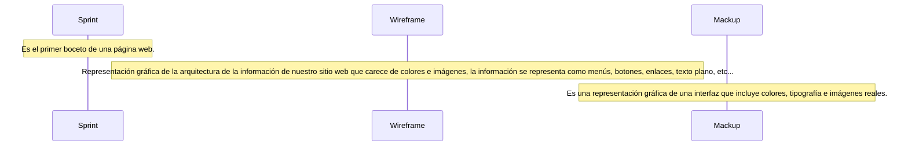

Sketchs, Wireframes, MockUps y Prototipos

```mermaid
sequenceDiagram
participant Sprint
participant Wireframe
participant Mackup
Note over Sprint: Es el primer boceto de una página web.
	Note over Wireframe: Representación gráfica de la arquitectura de la información de nuestro sitio web que carece de colores e imágenes, la información se representa como menús, botones, enlaces, texto plano, etc...
Note over Mackup: Es una representación gráfica de una interfaz que incluye colores, tipografía e imágenes reales.
```
